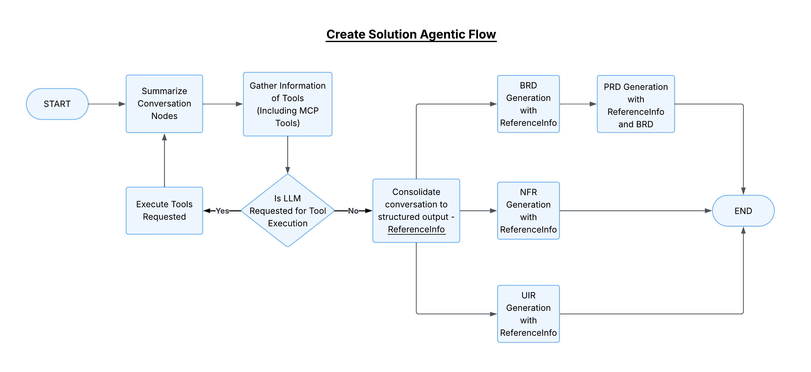
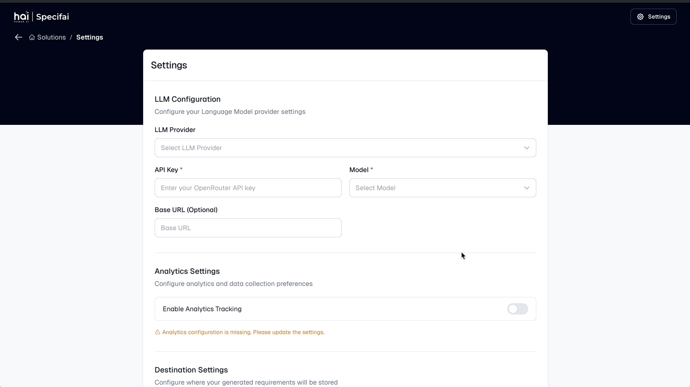
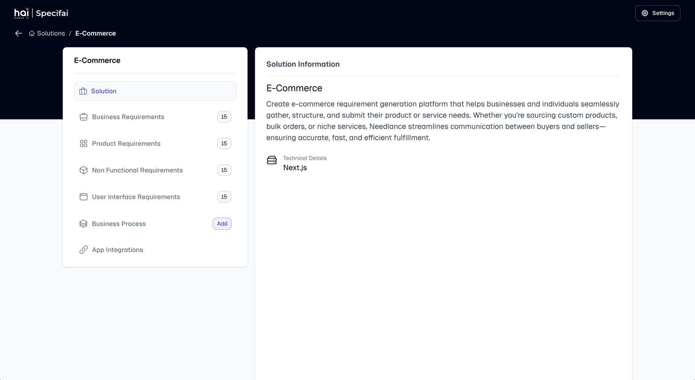

# Advanced Features

This guide covers the advanced capabilities of Specif-ai, helping you leverage its full potential for complex requirement management and solution development.

## Agentic Solution Requirement Generation

Specif-ai utilizes the Langgraph framework to deliver an efficient agentic workflow, enhancing the creation of solution requirements with precision.

### Key Phases

1. **Context Gathering Phase**
   - **Summarisation:** Analyzes solution metadata and conversation history
   - **Context Gathering:** Integrates data from Knowledge-Base
   - **Decision Point:** Assesses need for LLM tool execution
   - **Data Consolidation:** Organizes data into ReferenceInfo format

2. **Requirement Generation Phase**
   - Structured output drives creation of:
     - Business Requirements Document (BRD)
     - Product Requirements Document (PRD)
     - Non-functional Requirements (NFR)
     - User Interface Requirements (UIR)

## Multi-Model Support

### Supported Models

1. **Azure OpenAI**
   - gpt-4o
   - gpt-4o-mini

2. **AWS Bedrock**
   - anthropic.claude-3-7-sonnet-20250219-v1:0
   - anthropic.claude-3-5-sonnet-20241022-v2:0
   - anthropic.claude-3-5-haiku-20241022-v1:0
   - anthropic.claude-3-5-sonnet-20240620-v1:0
   - anthropic.claude-3-opus-20240229-v1:0
   - anthropic.claude-3-sonnet-20240229-v1:0
   - anthropic.claude-3-haiku-20240307-v1:0

3. **Gemini**
   - gemini-2.0-pro series
   - gemini-1.5-pro series
   - Various experimental models

4. **Additional Providers**
   - OpenRouter
   - Ollama

### Model Selection Strategy

Choose models based on:
- Task complexity
- Response speed requirements
- Cost considerations
- Specific capability needs

## Analytics & Observability

### Features
- Performance tracking
- Usage analytics
- Error monitoring
- Response time analysis

### Integration Options
- PostHog for analytics
- Langfuse for observability
- Custom tracking solutions

## BRD-PRD Linking

### Capabilities
1. **Contextual Linking**
   - Automatic reference creation
   - Requirement traceability
   - Impact analysis

2. **Smart Updates**
   - Synchronized changes
   - Version control
   - Change history

### Best Practices
- Maintain clear hierarchies
- Document relationships
- Regular synchronization
- Version management

## Custom Templates

### Template Management
1. **Creation**
   - Define structure
   - Set placeholders
   - Configure variables

2. **Usage**
   - Apply to new documents
   - Bulk application
   - Template versioning

### Template Types
- Document templates
- Process flow templates
- User story templates
- Task templates

## Version-Controlled Requirements

### Features
1. **Document Versioning**
   - Automatic version tracking
   - Change history
   - Rollback capabilities

2. **Collaboration Support**
   - Multi-user editing
   - Change merging
   - Conflict resolution

### Integration with VCS
- Git compatibility
- Branch management
- Merge workflow
- Review process

## Architecture Overview

### Key Components
1. **Frontend Layer**
   - Angular-based UI
   - Responsive design
   - Real-time updates

2. **Backend Services**
   - Electron core
   - API services
   - File system management

3. **Integration Layer**
   - MCP protocol
   - External services
   - Custom adapters

## Best Practices

### Performance Optimization
1. **Document Management**
   - Regular cleanup
   - Index optimization
   - Cache management

2. **Model Usage**
   - Load balancing
   - Fallback configuration
   - Response caching

### Security Considerations
1. **Access Control**
   - Role-based permissions
   - API key management
   - Audit logging

2. **Data Protection**
   - Encryption at rest
   - Secure transmission
   - Backup strategies

## Next Steps

To maximize your use of these advanced features:
1. Review the architecture documentation
2. Test different model configurations
3. Set up monitoring and analytics
4. Implement version control practices

For troubleshooting and common issues, refer to the [Troubleshooting & FAQs](troubleshooting.md) guide.
