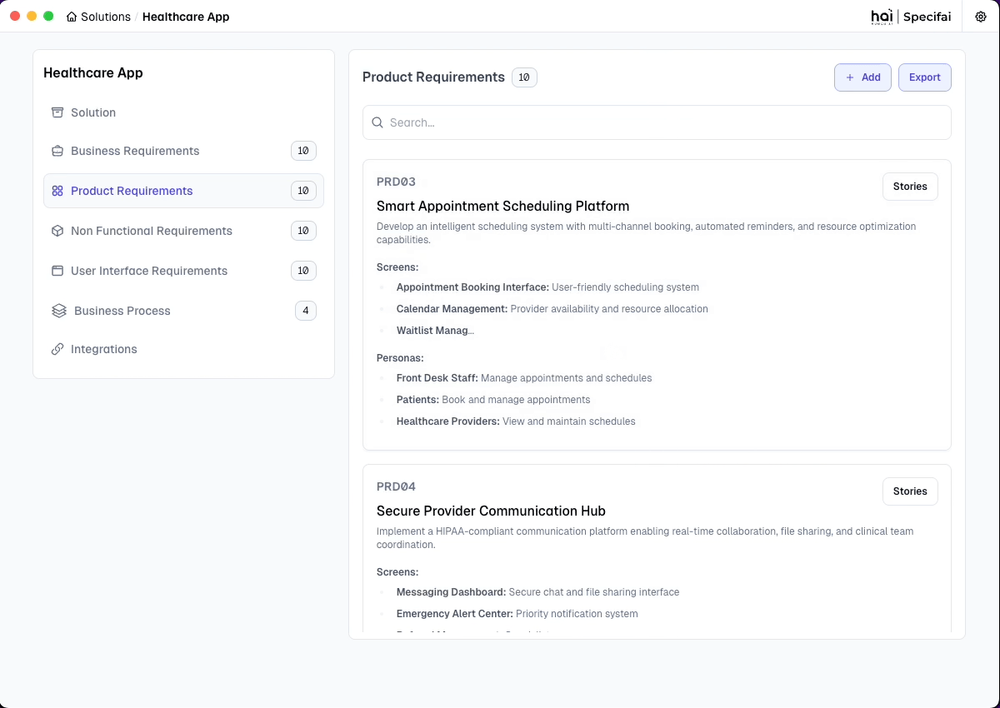

# Core Features of Specif-ai

This guide covers the main features and capabilities of Specif-ai, demonstrating how to effectively use the platform for your SDLC process.

## Solution Creation and Management

### Creating a New Solution

To create a new solution:
1. Click the "New Solution" button from the dashboard
2. Enter the solution details:
   - Solution Name
   - Description
   - Technical Stack
3. Click "Create" to generate your solution workspace

### AI-Powered Document Generation

Specif-ai automatically generates comprehensive documentation including:

1. **Business Requirement Documents (BRD)**
   - Business objectives
   - Stakeholder information
   - Success criteria

2. **Product Requirement Documents (PRD)**
   - Technical specifications
   - Feature descriptions
   - Implementation details

3. **Non-Functional Requirements (NFR)**
   - Performance requirements
   - Security specifications
   - Scalability considerations

4. **User Interface Requirements (UIR)**
   - UI/UX specifications
   - Design guidelines
   - User interaction flows

## Requirements Management

### Document Organization
- All documents are automatically organized in your chosen workspace
- Version control ready structure
- Easy navigation between related documents

### Chat Interface for Refinement

The AI-powered chat interface allows you to:
- Refine requirements in real-time
- Get contextual suggestions
- Clarify technical specifications
- Enhance document quality through intelligent conversations

### Business Process Visualization

Create and manage business process flows:
- Visual process mapping
- Workflow optimization
- Stakeholder communication
- Process documentation

## User Stories & Tasks

### Generation Process
1. AI analyzes your requirements
2. Automatically generates user stories
3. Creates associated tasks
4. Maintains traceability to requirements

### Management and Organization
- Hierarchical story structure
- Task prioritization
- Effort estimation
- Sprint planning support

### Best Practices
1. **Story Creation**
   - Use clear, concise language
   - Follow INVEST criteria
   - Include acceptance criteria

2. **Task Management**
   - Break down complex stories
   - Assign appropriate priorities
   - Link to relevant documentation

## Model Configuration

### Available Models
- Azure OpenAI (gpt-4o, gpt-4o-mini)
- OpenAI Native
- AWS Bedrock
- Gemini
- OpenRouter
- Ollama

### Configuration Steps
1. Access the settings panel
2. Select your preferred model
3. Configure API credentials
4. Test the connection
5. Save your preferences

## Next Steps

To learn about integrating Specif-ai with other tools and services, proceed to the [Integrations Setup](integrations-setup.md) guide.
