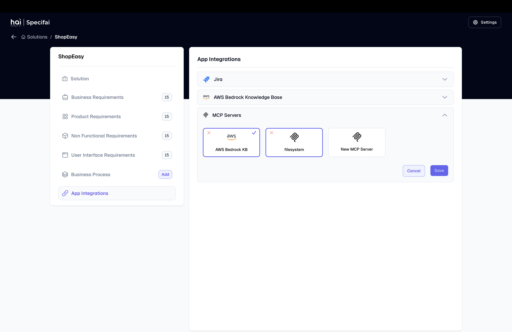
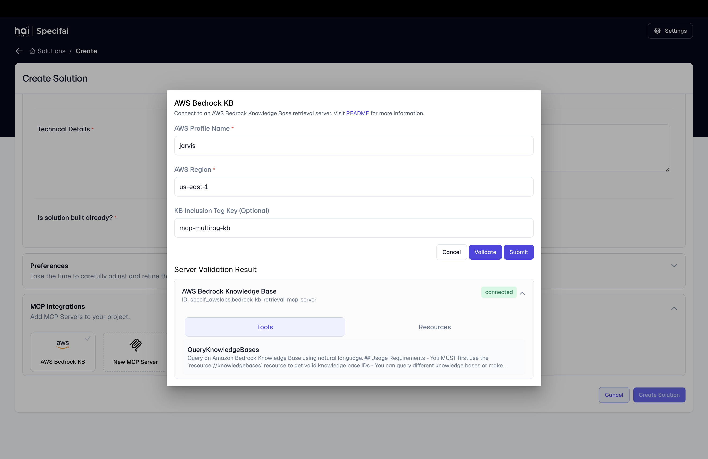
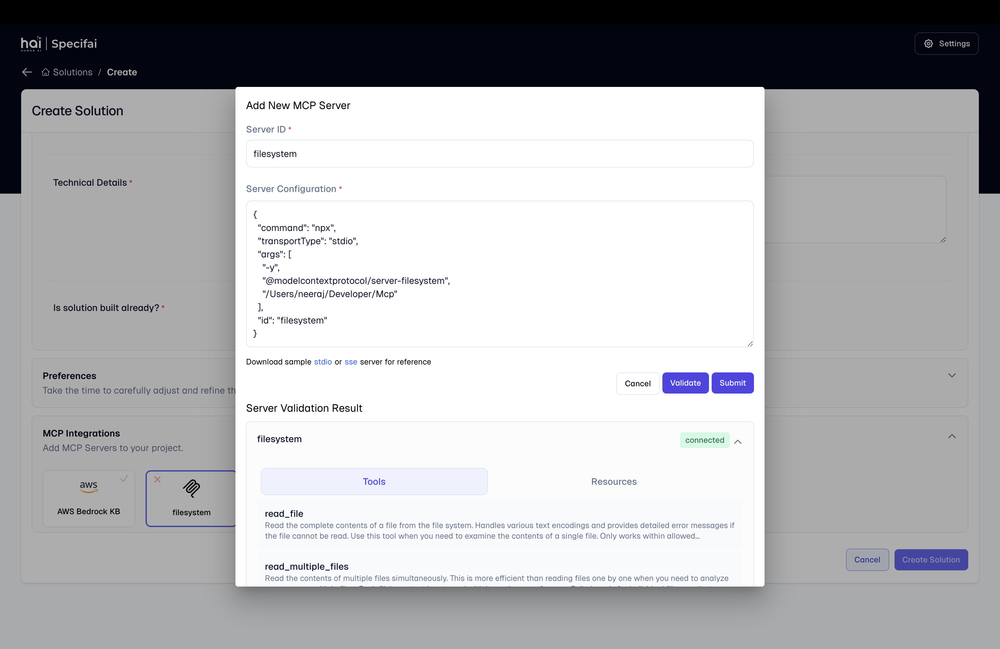

# Integrations Setup Guide

This guide covers the configuration and setup of various integrations available in Specif-ai, including Jira, AWS Bedrock Knowledge Base, and Model Context Protocol (MCP) servers.

## Jira Integration



Specif-ai seamlessly integrates with Jira to help you manage your project tasks and user stories effectively.

### Prerequisites
- Active Jira account with administrative access
- Jira project where you want to create stories/tasks

### OAuth 2.0 Setup Process

1. **Create OAuth 2.0 Integration**
   - Visit the [Atlassian Developer Console](https://developer.atlassian.com/console/myapps/)
   - Click "Create New App"
   - Select "OAuth 2.0 Integration"
   - Name your app (e.g., "Specifai Integration")

2. **Configure Permissions**
   - Navigate to Permissions tab
   - Add required APIs:
     - User Identity API
     - Jira API
   - Set the following scopes:
     - `read:jira-work`
     - `read:jira-user`
     - `write:jira-work`

3. **Set Authorization Details**
   - Go to Authorization tab
   - Configure callback URL: `http://localhost:49153/callback`
   - Save the configuration

4. **Retrieve OAuth Credentials**
   - Copy the Client ID and Client Secret
   - Store these securely for the next step

### Specif-ai Configuration

1. Navigate to Solution -> Integration page
2. Enter the following details:
   - Client ID
   - Client Secret
   - Project Key
   - Callback URL
3. Click "Verify" to test the connection
4. Save the configuration

## AWS Bedrock Knowledge Base



The AWS Bedrock Knowledge Base integration enhances Specif-ai's AI capabilities with enterprise knowledge.

### Prerequisites

Install required tools:
```bash
# For macOS
brew install awscli
brew install uv

# For Windows
# Download AWS CLI from: https://aws.amazon.com/cli/
winget install uv
```

### Configuration Steps

1. **AWS Profile Setup**
   ```bash
   aws configure --profile <name>
   ```
   Enter:
   - AWS Access Key ID
   - AWS Secret Access Key
   - Region (e.g., us-east-1)
   - Output format

2. **Bedrock KB Configuration**
   - Open the configuration interface
   - Enter:
     - Profile name (from step 1)
     - Region
     - Tag key: `specif-mcp-rag-kb`
   - Click "Validate"
   - Submit configuration

### Troubleshooting
- Invalid profile: Check credentials in `.aws/credentials`
- Connection issues: Verify internet connectivity
- Region errors: Confirm AWS Bedrock availability

## Model Context Protocol (MCP)



MCP enables Specif-ai to connect with external tools, services, and knowledge bases.

### Custom MCP Server Integration

1. **Access MCP Settings**
   - Navigate to Integrations page
   - Select "Add Custom Server"

2. **Server Configuration**
   - Enter server details:
     - Name
     - URL
     - Authentication details (if required)
   - Test connection
   - Save configuration

### Managing MCP Servers


- View all connected servers
- Monitor server status
- Edit configurations
- Enable/disable servers
- Remove servers when needed

### Best Practices

1. **Security**
   - Use secure connections (HTTPS)
   - Regularly rotate credentials
   - Monitor server access logs

2. **Performance**
   - Keep servers geographically close
   - Monitor response times
   - Implement proper error handling

3. **Maintenance**
   - Regular updates
   - Backup configurations
   - Document custom implementations

## Next Steps

After setting up integrations:
1. Test each integration thoroughly
2. Configure automated backups
3. Train team members on usage

For advanced features and customization options, proceed to the [Advanced Features](advanced-features.md) guide.
