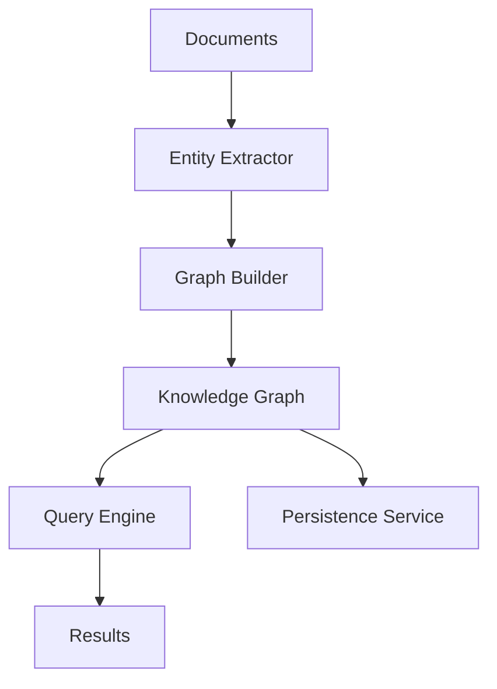

# Knowledge Graph Module

A powerful knowledge graph system for document processing and semantic querying, designed to be easily packaged with Electron applications.

## Installation & Setup

1. **Install Dependencies and Verify Setup**
```bash
npm run kg:setup
```
This will:
- Install all required dependencies
- Build the TypeScript code
- Verify the Knowledge Graph module setup
- Check all components and directories
- Validate visualization capabilities

2. **Verify Setup Only**
```bash
npm run kg:verify
```

## Quick Start

1. **Run the Quick Test with Visualization**
```bash
npm run kg:visualize
```
This will:
- Process a sample company information document
- Extract entities and relationships
- Run example queries
- Generate and open interactive visualizations

2. **Run Comprehensive Tests**
```bash
npm run test:kg:all
```
This runs both quick and comprehensive tests.

3. **Clean Up Generated Files**
```bash
npm run kg:clean
```

## Available Scripts

- `npm run kg:setup` - Install dependencies and verify setup
- `npm run kg:verify` - Verify Knowledge Graph module setup
- `npm run kg:visualize` - Run quick test with visualization
- `npm run test:kg` - Run comprehensive tests
- `npm run test:kg:quick` - Run quick test only
- `npm run test:kg:all` - Run all tests
- `npm run kg:clean` - Clean up generated files
- `npm run kg:example` - Run document processor example

## Features

- **Document Processing**: Extract entities and relationships from various document types
- **Graph Construction**: Build and maintain a knowledge graph from extracted information
- **Multiple Query Types**: Support for semantic, structured, and hybrid queries
- **Persistence**: Save and load graph data with backup support
- **Efficient Caching**: Query result caching for improved performance
- **Interactive Visualization**: Browser-based graph visualization with multiple layouts

## Architecture



## Components

### 1. Entity Extractor
- Uses NLP.js and Compromise for entity extraction
- Supports multiple entity types (people, organizations, locations, etc.)
- Extracts relationships between entities
- Configurable confidence thresholds

### 2. Graph Builder
- Constructs graph from extracted entities and relations
- Maintains in-memory graph structure
- Supports incremental updates
- Provides graph statistics and metrics

### 3. Query Engine
- **Semantic Queries**: Natural language understanding
- **Structured Queries**: Pattern-based graph traversal
- **Hybrid Queries**: Combines semantic and structured approaches
- Query result caching
- Configurable search parameters

### 4. Persistence Service
- JSON-based storage
- Automatic backups
- Import/Export functionality
- Graph versioning support

### 5. Visualization
- Interactive browser-based visualization
- Multiple layout options (standard, hierarchical, circular)
- Node and edge tooltips
- Color-coded node types
- Zoom and pan controls
- Physics simulation controls

## Usage Examples

### Basic Setup
```typescript
import { KnowledgeGraphHandler } from './handlers/knowledge-graph-handler';

// Initialize the handler
const kgHandler = new KnowledgeGraphHandler();

// Process a document
await kgHandler.handleProcessDocument(event, filePath);
```

### Querying
```typescript
// Semantic Query
const result = await window.electronAPI.semanticSearch({
  query: "Who is the CEO?",
  options: {
    similarityThreshold: 0.5,
    maxDistance: 2
  }
});

// Structured Query
const result = await window.electronAPI.structuredSearch({
  nodes: [{ label: 'person', properties: { role: 'CEO' } }],
  edges: []
});

// Hybrid Query
const result = await window.electronAPI.query({
  type: 'hybrid',
  semantic: {
    query: "Who works in the engineering team?"
  },
  structured: {
    patterns: {
      nodes: [{ label: 'team', properties: { name: 'engineering' } }]
    }
  },
  strategy: 'weighted'
});
```

### Graph Management
```typescript
// Export graph
const exportPath = await window.electronAPI.exportGraph();

// Import graph
await window.electronAPI.importGraph();

// Get statistics
const stats = await window.electronAPI.getStats();
```

## Visualization Features

1. **Multiple Layouts**
   - Standard force-directed layout
   - Hierarchical layout
   - Circular layout

2. **Interactive Controls**
   - Zoom in/out
   - Pan view
   - Node dragging
   - Physics simulation toggle

3. **Visual Elements**
   - Color-coded node types
   - Directional edges
   - Node and edge labels
   - Tooltips with detailed information

4. **Statistics Panel**
   - Total node count
   - Total relationship count
   - Node type distribution
   - Relationship type distribution

## Configuration

Key configuration options in `types/entity.types.ts`:
```typescript
interface EntityExtractorConfig {
  minConfidence: number;
  maxEntitiesPerDocument: number;
  supportedLanguages: string[];
}
```

Graph persistence options in `types/graph.types.ts`:
```typescript
interface GraphPersistenceOptions {
  format: 'json' | 'sqlite';
  path: string;
  compression?: boolean;
  backup?: boolean;
}
```

## Error Handling

- All operations are wrapped in try-catch blocks
- Detailed error messages with error codes
- Automatic backup before potentially destructive operations
- Error events are propagated to the UI

## Performance Considerations

- In-memory graph for fast querying
- Query result caching
- Batch processing for multiple documents
- Configurable auto-save intervals
- Efficient graph traversal algorithms

## Contributing

1. Run tests before submitting changes:
```bash
npm run test:kg:all
```

2. Clean up generated files:
```bash
npm run kg:clean
```

3. Follow the TypeScript coding standards
4. Update tests for new features
5. Document changes in the README
6. Create a pull request with a clear description

## Troubleshooting

If you encounter issues:

1. Run the setup verification:
```bash
npm run kg:verify
```

2. Common issues:
   - Dependencies not installed (`npm install`)
   - TypeScript not compiled (`npm run build`)
   - File permissions issues
   - Missing directories or files
   - Visualization dependencies not loaded

3. Check logs and error messages:
   - Electron app logs
   - Console output
   - Verification script results

For more help, see the examples in `examples/` directory or open an issue.
