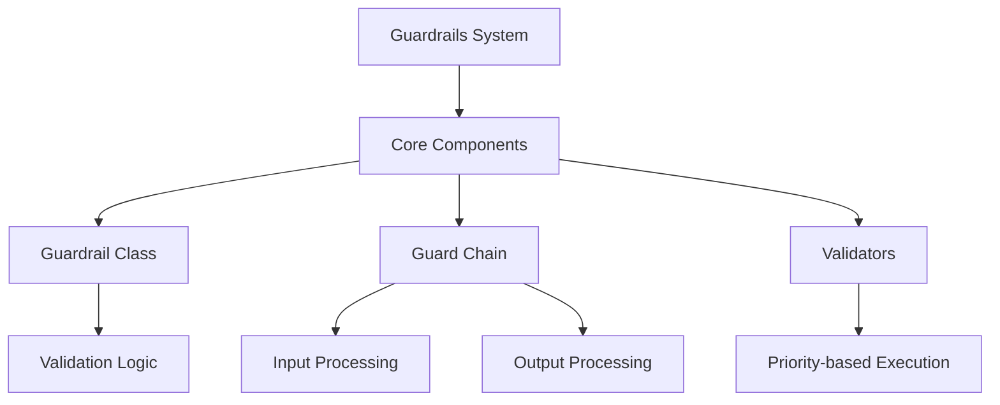
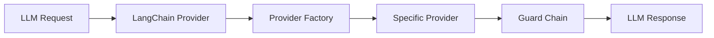
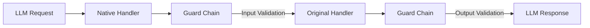

# Guardrails System

A robust validation and safety system for LLM operations and agent interactions.



## Implementation Architecture

### LangChain Implementation


### Native Handler Implementation


## Overview

The Guardrails system provides a flexible and extensible framework for implementing safety checks and validation rules for LLM operations. It ensures both input and output validation through a chain of prioritized guards and validators.

### Key Features

- Priority-based validation chain
- Bidirectional processing (input/output validation)
- Configurable strict mode
- Extensible validator system
- Comprehensive error handling and reporting
- Content sanitization capabilities

## Architecture

### Core Components

1. **Guardrail Class**
   - Orchestrates validation process
   - Manages validator priority
   - Handles configuration and error reporting

2. **Guard Chain**
   - Implements chain of responsibility pattern
   - Processes both input and output
   - Maintains validation order based on priority

3. **Validators**
   - Modular validation components
   - Priority-based execution
   - Customizable validation logic

## Usage

### Basic Setup

```typescript
import { Guardrail } from './core/guardrail';
import { ContentValidator } from './validators/content';
import { BoundaryValidator } from './validators/boundary';

// Create validators
const contentValidator = new ContentValidator();
const boundaryValidator = new BoundaryValidator();

// Initialize guardrail with validators
const guardrail = new Guardrail([
  contentValidator,
  boundaryValidator
]);

// Configure guardrail
guardrail.updateConfig({
  strict: true,
  logLevel: 'warn'
});
```

### Validation Example

```typescript
// Context for validation
const context: GuardrailContext = {
  type: 'llm',
  operation: 'generate',
  metadata: {
    model: 'gpt-4'
  }
};

try {
  const result = await guardrail.validate(input, context);
  if (result.isValid) {
    // Process validated input
    console.log('Input validated successfully');
    console.log('Sanitized content:', result.sanitizedContent);
  }
} catch (error) {
  if (error instanceof GuardrailError) {
    console.error('Validation failed:', error.message);
  }
}
```

### Guard Chain Implementation

```typescript
// Create a guard chain
const guardChain = new GuardChain([
  new ScopeGuard(),
  new ContentGuard()
]);

// Process input through the chain
const processedInput = await guardChain.processInput(messages, context);

// Process output through the chain
const processedOutput = await guardChain.processOutput(response, context);
```

## Configuration

### GuardrailConfig Interface

```typescript
interface GuardrailConfig {
  strict: boolean;           // Throw errors on validation failures
  logLevel: string;         // error | warn | info | debug
  validationOptions?: any;  // Custom validation options
}
```

### Default Configuration

```typescript
const DEFAULT_GUARDRAIL_CONFIG = {
  strict: true,
  logLevel: 'warn'
};
```

## Best Practices

### Validator Priority Management

- Assign lower numbers for higher priority validators
- Critical validators should run first
- Content sanitization should typically run last

### Error Handling

- Use strict mode in production for maximum safety
- Implement proper error recovery mechanisms
- Log validation failures for monitoring

### Custom Validator Implementation

```typescript
import { BaseValidator } from './core/base-validator';

export class CustomValidator extends BaseValidator {
  constructor() {
    super('custom-validator', 100); // ID and priority
  }

  async validate(input: any, context: GuardrailContext): Promise<ValidationResult> {
    // Implement validation logic
    return {
      isValid: true,
      messages: [],
      sanitizedContent: input
    };
  }
}
```

### Configuration Recommendations

1. **Development Environment**
   ```typescript
   {
     strict: false,
     logLevel: 'debug'
   }
   ```

2. **Production Environment**
   ```typescript
   {
     strict: true,
     logLevel: 'warn'
   }
   ```

## API Reference

### Core Types

```typescript
type GuardrailOperationType = 'llm' | 'agent';

interface GuardrailContext {
  type: GuardrailOperationType;
  operation: string;
  metadata?: Record<string, any>;
}

interface ValidationResult {
  isValid: boolean;
  messages: string[];
  sanitizedContent?: any;
}
```

### Error Handling

```typescript
class GuardrailError extends Error {
  constructor(message: string, public context: GuardrailContext) {
    super(message);
    this.name = 'GuardrailError';
  }
}
```

## Contributing

When implementing new validators or guards:

1. Extend the appropriate base class (`BaseValidator` or `BaseGuard`)
2. Assign appropriate priority levels
3. Implement comprehensive error messages
4. Add proper TypeScript types
5. Include unit tests for validation logic
